# Two Pointer Algorithm Guide

## What is Two Pointer Algorithm?

The **Two Pointer Algorithm** is a technique where you use two pointers (indices) that traverse through a data structure (usually an array or string) to solve problems efficiently. The pointers can move in the same direction, opposite directions, or at different speeds.

## Key Concepts

### Types of Two Pointer Patterns:

1. **Opposite Ends (Converging)**
   - One pointer starts at the beginning, another at the end
   - They move towards each other
   - Example: Finding pairs in a sorted array

2. **Same Direction (Fast & Slow)**
   - Both pointers start at the beginning
   - One moves faster than the other
   - Example: Detecting cycles, removing duplicates

3. **Sliding Window**
   - Two pointers maintain a window of elements
   - Window expands or contracts based on conditions
   - Example: Finding subarrays with specific properties

## When to Use Two Pointer Algorithm?

### Common Scenarios:

1. **Sorted Arrays/Lists**
   - Finding pairs that sum to a target
   - Merging sorted arrays
   - Removing duplicates

2. **String Manipulation**
   - Palindrome checking
   - Reversing strings
   - Finding substrings

3. **Linked Lists**
   - Finding middle node
   - Detecting cycles
   - Reversing linked list

4. **Array Problems**
   - Trapping rainwater
   - Container with most water
   - Moving zeros

5. **Optimization Problems**
   - Reducing time complexity from O(n²) to O(n)
   - Reducing space complexity

## Advantages

- **Time Complexity**: Often reduces O(n²) to O(n)
- **Space Complexity**: Usually O(1) extra space
- **Efficiency**: Single pass through the data structure
- **Simplicity**: Clean and readable code

---

# Top 20 LeetCode Two Pointer Problems

## Problem 1: Two Sum (Sorted Array)

**Difficulty:** Easy  
**LeetCode #:** 167

### Description
Given a **1-indexed** array of integers `numbers` that is already **sorted in non-decreasing order**, find two numbers such that they add up to a specific `target` number. Let these two numbers be `numbers[index1]` and `numbers[index2]` where `1 <= index1 < index2 <= numbers.length`.

Return *the indices of the two numbers, `[index1, index2]`, **added by one** as an integer array `[index1, index2]` of length 2*.

The tests are generated such that there is **exactly one solution**. You **may not** use the same element twice.

Your solution must use only constant extra space.

### Example 1:
```
Input: numbers = [2,7,11,15], target = 9
Output: [1,2]
Explanation: The sum of 2 and 7 is 9. Therefore, index1 = 1, index2 = 2. We return [1, 2].
```

### Example 2:
```
Input: numbers = [2,3,4], target = 6
Output: [1,3]
Explanation: The sum of 2 and 4 is 6. Therefore index1 = 1, index2 = 3. We return [1, 3].
```

### Example 3:
```
Input: numbers = [-1,0], target = -1
Output: [1,2]
Explanation: The sum of -1 and 0 is -1. Therefore index1 = 1, index2 = 2. We return [1, 2].
```

### Constraints:
- `2 <= numbers.length <= 3 * 10^4`
- `-1000 <= numbers[i] <= 1000`
- `numbers` is sorted in **non-decreasing order**
- `-1000 <= target <= 1000`
- The tests are generated such that there is **exactly one solution**

### Test Cases:
```python
# Test Case 1
numbers = [2,7,11,15]
target = 9
# Expected: [1,2]

# Test Case 2
numbers = [2,3,4]
target = 6
# Expected: [1,3]

# Test Case 3
numbers = [-1,0]
target = -1
# Expected: [1,2]

# Test Case 4
numbers = [1,2,3,4,4,9,56,90]
target = 8
# Expected: [4,5]
```

---

## Problem 2: Valid Palindrome

**Difficulty:** Easy  
**LeetCode #:** 125

### Description
A phrase is a **palindrome** if, after converting all uppercase letters into lowercase letters and removing all non-alphanumeric characters, it reads the same forward and backward. Alphanumeric characters include letters and numbers.

Given a string `s`, return `true` *if it is a **palindrome**, or `false` otherwise*.

### Example 1:
```
Input: s = "A man, a plan, a canal: Panama"
Output: true
Explanation: "amanaplanacanalpanama" is a palindrome.
```

### Example 2:
```
Input: s = "race a car"
Output: false
Explanation: "raceacar" is not a palindrome.
```

### Example 3:
```
Input: s = " "
Output: true
Explanation: s is an empty string "" after removing non-alphanumeric characters.
Since an empty string reads the same forward and backward, it is a palindrome.
```

### Constraints:
- `1 <= s.length <= 2 * 10^5`
- `s` consists only of printable ASCII characters

### Test Cases:
```python
# Test Case 1
s = "A man, a plan, a canal: Panama"
# Expected: True

# Test Case 2
s = "race a car"
# Expected: False

# Test Case 3
s = " "
# Expected: True

# Test Case 4
s = "Madam"
# Expected: True

# Test Case 5
s = "No 'x' in Nixon"
# Expected: True
```

---

## Problem 3: Container With Most Water

**Difficulty:** Medium  
**LeetCode #:** 11

### Description
You are given an integer array `height` of length `n`. There are `n` vertical lines drawn such that the two endpoints of the `i`th line are `(i, 0)` and `(i, height[i])`.

Find two lines that together with the x-axis form a container, such that the container contains the most water.

Return *the maximum amount of water a container can store*.

**Notice** that you may not slant the container.

### Example 1:
```
Input: height = [1,8,6,2,5,4,8,3,7]
Output: 49
Explanation: The above vertical lines are represented by array [1,8,6,2,5,4,8,3,7]. In this case, the max area of water (blue section) the container can contain   is 49.
```

### Example 2:
```
Input: height = [1,1]
Output: 1
```

### Constraints:
- `n == height.length`
- `2 <= n <= 10^5`
- `0 <= height[i] <= 10^4`

### Test Cases:
```python
# Test Case 1
height = [1,8,6,2,5,4,8,3,7]
# Expected: 49

# Test Case 2
height = [1,1]
# Expected: 1

# Test Case 3
height = [1,2,1]
# Expected: 2

# Test Case 4
height = [4,3,2,1,4]
# Expected: 16

# Test Case 5
height = [1,2,4,3]
# Expected: 4
```
solution
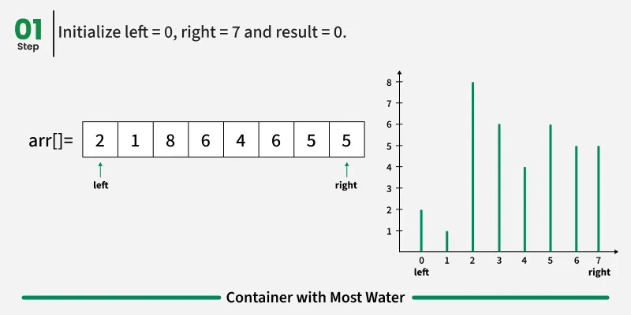
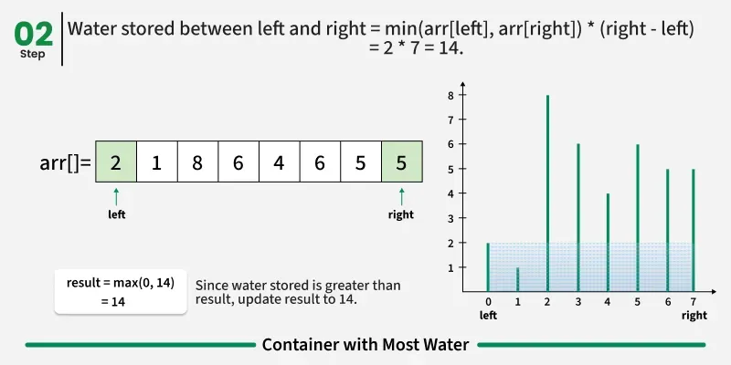
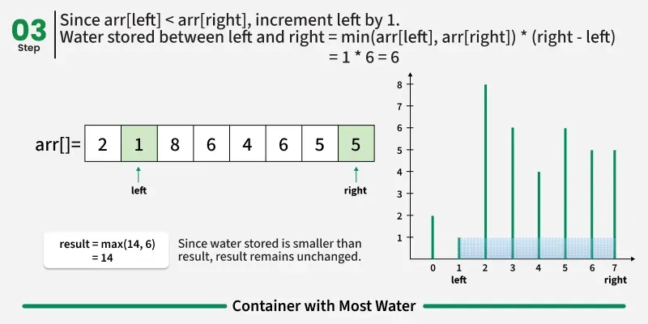
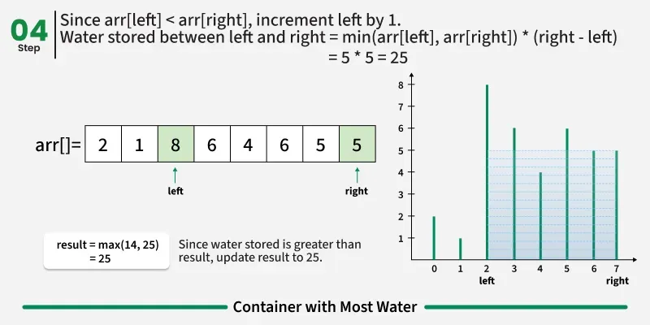
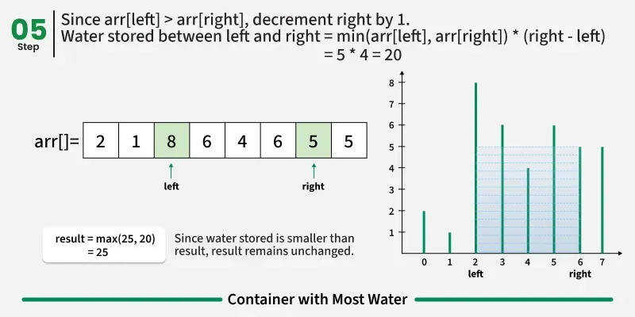
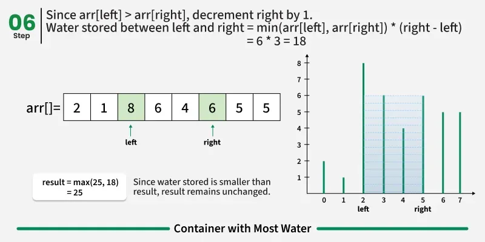
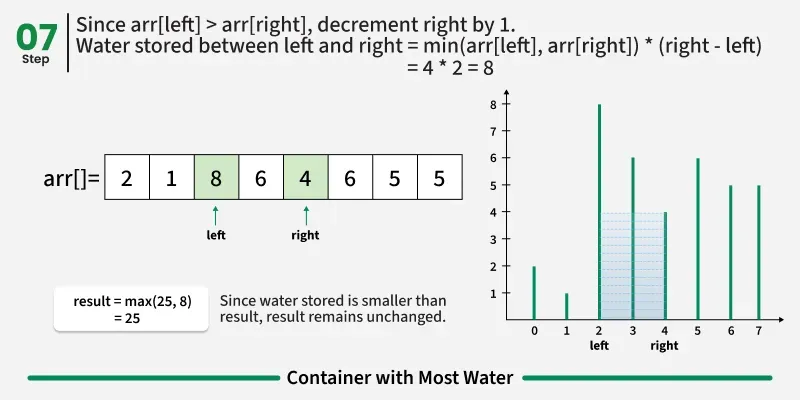
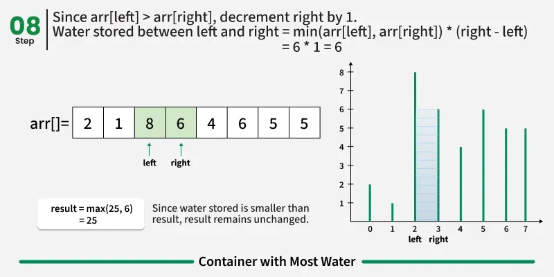
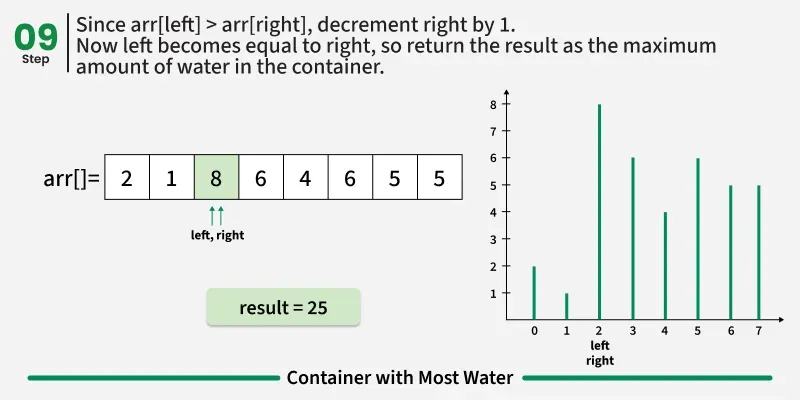
---

## Problem 4: 3Sum

**Difficulty:** Medium  
**LeetCode #:** 15

### Description
Given an integer array `nums`, return all the triplets `[nums[i], nums[j], nums[k]]` such that `i != j`, `i != k`, and `j != k`, and `nums[i] + nums[j] + nums[k] == 0`.

Notice that the solution set must **not contain duplicate triplets**.

### Example 1:
```
Input: nums = [-1,0,1,2,-1,-4]
Output: [[-1,-1,2],[-1,0,1]]
Explanation: 
nums[0] + nums[1] + nums[2] = (-1) + 0 + 1 = 0.
nums[1] + nums[2] + nums[4] = 0 + 1 + (-1) = 0.
The distinct triplets are [-1,0,1] and [-1,-1,2].
Notice that the order of the output and the order of the triplets does not matter.
```

### Example 2:
```
Input: nums = [0,1,1]
Output: []
Explanation: The only possible triplet does not sum up to 0.
```

### Example 3:
```
Input: nums = [0,0,0]
Output: [[0,0,0]]
Explanation: The only possible triplet sums up to 0.
```

### Constraints:
- `3 <= nums.length <= 3000`
- `-10^5 <= nums[i] <= 10^5`

### Test Cases:
```python
# Test Case 1
nums = [-1,0,1,2,-1,-4]
# Expected: [[-1,-1,2],[-1,0,1]]

# Test Case 2
nums = [0,1,1]
# Expected: []

# Test Case 3
nums = [0,0,0]
# Expected: [[0,0,0]]

# Test Case 4
nums = [-2,0,1,1,2]
# Expected: [[-2,0,2],[-2,1,1]]

# Test Case 5
nums = [-1,0,1,2,-1,-4,-2,-3,3,0,4]
# Expected: [[-4,0,4],[-4,1,3],[-3,-1,4],[-3,0,3],[-3,1,2],[-2,-1,3],[-2,0,2],[-1,-1,2],[-1,0,1]]
```

---

## Problem 5: Remove Duplicates from Sorted Array

**Difficulty:** Easy  
**LeetCode #:** 26

### Description
Given an integer array `nums` sorted in **non-decreasing order**, remove the duplicates **in-place** such that each unique element appears only **once**. The **relative order** of the elements should be **kept the same**. Then return *the number of unique elements in `nums`*.

Consider the number of unique elements of `nums` to be `k`, to get accepted, you need to do the following things:

- Change the array `nums` such that the first `k` elements of `nums` contain the unique elements in the order they were present in `nums` initially. The remaining elements of `nums` are not important as well as the size of `nums`.
- Return `k`.

### Example 1:
```
Input: nums = [1,1,2]
Output: 2, nums = [1,2,_]
Explanation: Your function should return k = 2, with the first two elements of nums being 1 and 2 respectively.
It does not matter what you leave beyond the returned k (hence they are underscores).
```

### Example 2:
```
Input: nums = [0,0,1,1,1,2,2,3,3,4]
Output: 5, nums = [0,1,2,3,4,_,_,_,_,_]
Explanation: Your function should return k = 5, with the first five elements of nums being 0, 1, 2, 3, and 4 respectively.
It does not matter what you leave beyond the returned k (hence they are underscores).
```

### Constraints:
- `1 <= nums.length <= 3 * 10^4`
- `-100 <= nums[i] <= 100`
- `nums` is sorted in **non-decreasing order**

### Test Cases:
```python
# Test Case 1
nums = [1,1,2]
# Expected: 2, nums = [1,2]

# Test Case 2
nums = [0,0,1,1,1,2,2,3,3,4]
# Expected: 5, nums = [0,1,2,3,4]

# Test Case 3
nums = [1,1,1]
# Expected: 1, nums = [1]

# Test Case 4
nums = [1,2,3,4,5]
# Expected: 5, nums = [1,2,3,4,5]

# Test Case 5
nums = [1,1,1,2,2,3]
# Expected: 3, nums = [1,2,3]
```

---

## Problem 6: Trapping Rain Water

**Difficulty:** Hard  
**LeetCode #:** 42

### Description
Given `n` non-negative integers representing an elevation map where the width of each bar is `1`, compute how much water it can trap after raining.

### Example 1:
```
Input: height = [0,1,0,2,1,0,1,3,2,1,2,1]
Output: 6
Explanation: The above elevation map (black section) is represented by array [0,1,0,2,1,0,1,3,2,1,2,1]. In this case, 6 units of rain water (blue section) are being trapped.
```

### Example 2:
```
Input: height = [4,2,0,3,2,5]
Output: 9
```

### Constraints:
- `n == height.length`
- `1 <= n <= 2 * 10^4`
- `0 <= height[i] <= 10^5`

### Test Cases:
```python
# Test Case 1
height = [0,1,0,2,1,0,1,3,2,1,2,1]
# Expected: 6

# Test Case 2
height = [4,2,0,3,2,5]
# Expected: 9

# Test Case 3
height = [3,0,2,0,4]
# Expected: 7

# Test Case 4
height = [2,0,2]
# Expected: 2

# Test Case 5
height = [5,4,1,2]
# Expected: 1
```
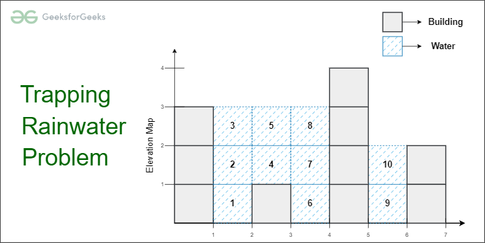

[Naive Approach] Brute Force - O(n^2) Time and O(1) Space
Traverse every array element and find the highest bars on the left and right sides. Take the smaller of two heights. The difference between the smaller height and the height of the current element is the amount of water that can be stored in this array element.

function maxWater(arr) {
    let res = 0;

    // For every element of the array
    for (let i = 1; i < arr.length - 1; i++) {

        // Find the maximum element on its left
        let left = arr[i];
        for (let j = 0; j < i; j++)
            left = Math.max(left, arr[j]);

        // Find the maximum element on its right
        let right = arr[i];
        for (let j = i + 1; j < arr.length; j++)
            right = Math.max(right, arr[j]);

        // Update the maximum water
        res += Math.min(left, right) - arr[i];
    }

    return res;
}

// Driver code
let arr = [2, 1, 5, 3, 1, 0, 4];
console.log(maxWater(arr));


[Better Approach] Prefix and suffix max for each index - O(n) Time and O(n) Space


In the previous approach, for every element we needed to calculate the highest element on the left and on the right. 
So, to reduce the time complexity:
=> For every element we first calculate and store the highest bar on the left and on the right (say stored in arrays left[] and right[]).
=> Then iterate the array and use the calculated values to find the amount of water stored in this index, 
which is the same as (min(left[i], right[i]) - arr[i])
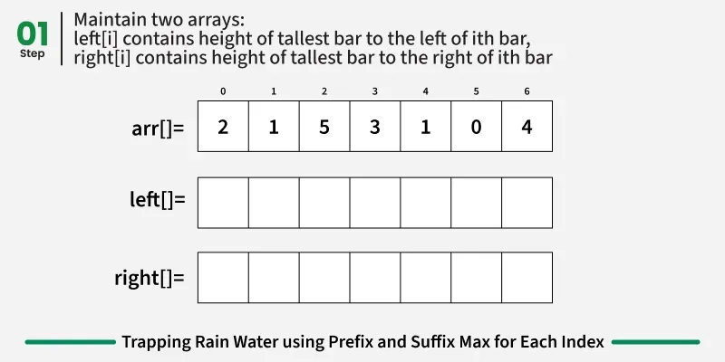
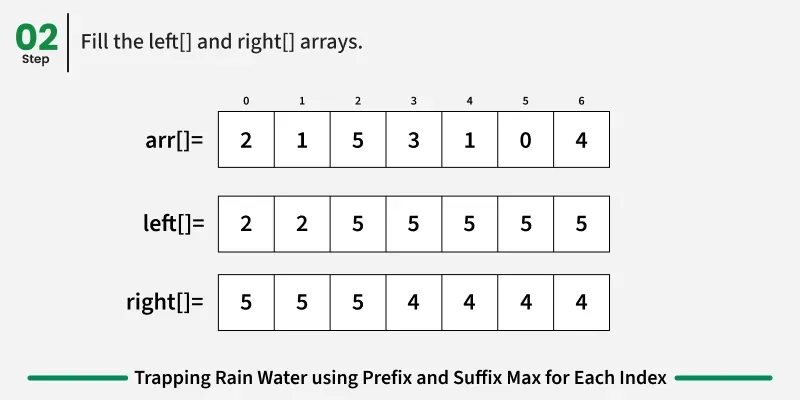
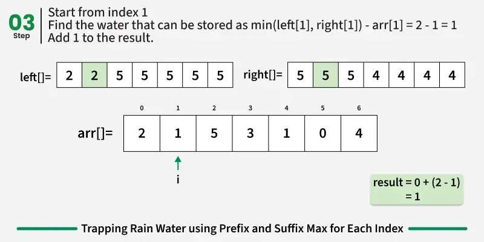
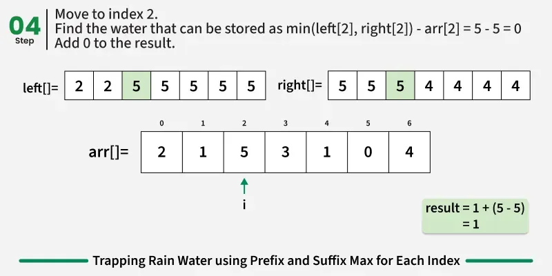
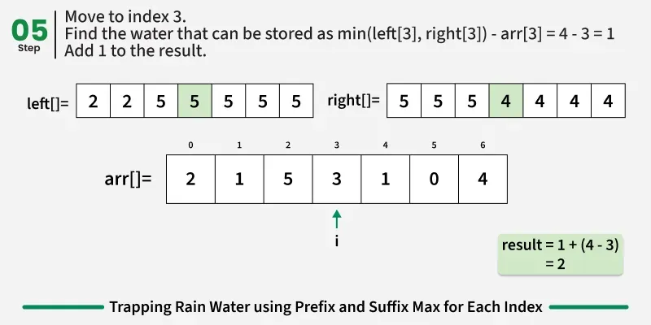
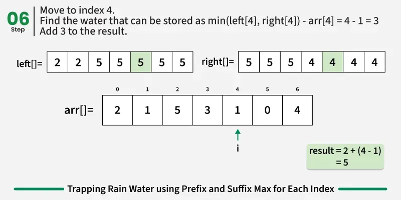
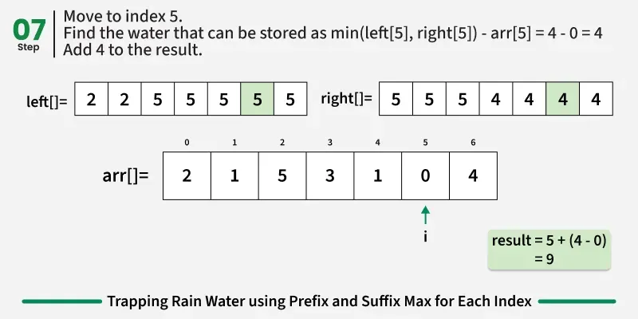
function maxWater(arr) {
    const n = arr.length;

    let left = Array(n);
    let right = Array(n);
    let res = 0;

    // fill left array
    left[0] = arr[0];
    for (let i = 1; i < n; i++) {
        left[i] = Math.max(left[i - 1], arr[i]);
    }

    // fill right array
    right[n - 1] = arr[n - 1];
    for (let i = n - 2; i >= 0; i--) {
        right[i] = Math.max(right[i + 1], arr[i]);
    }

    // calculate the accumulated water element
    // by element
    for (let i = 1; i < n - 1; i++) {
        let minOf2 = Math.min(left[i], right[i]);
        res += minOf2 - arr[i];
    }

    return res;
}

// Driver Code
const arr = [2, 1, 5, 3, 1, 0, 4];
console.log(maxWater(arr));

[Expected Approach] Using Two Pointers - O(n) Time and O(1) Space
The approach is mainly based on the following facts:

If we consider a subarray arr[left...right], we can decide the amount of water either for arr[left] or arr[right] if we know the left max (max element in arr[0...left-1]) and right max (max element in arr[right+1...n-1].
If left max is less than the right max, then we can decide for arr[left]. Else we can decide for arr[right]
If we decide for arr[left], then the amount of water would be left max - arr[left] and if we decide for arr[right], then the amount of water would be right max - arr[right].
How does this work?

Let us consider the case when left max is less than the right max. For arr[left], we know left max for it and we also know that the right max for it would not be less than left max because we already have a greater value in arr[right...n-1]. So for the current bar, we can find the amount of water by finding the difference between the current bar and the left max bar.

trapping---------rain---------water---------problem---------using---------two---------pointers---------7.webp
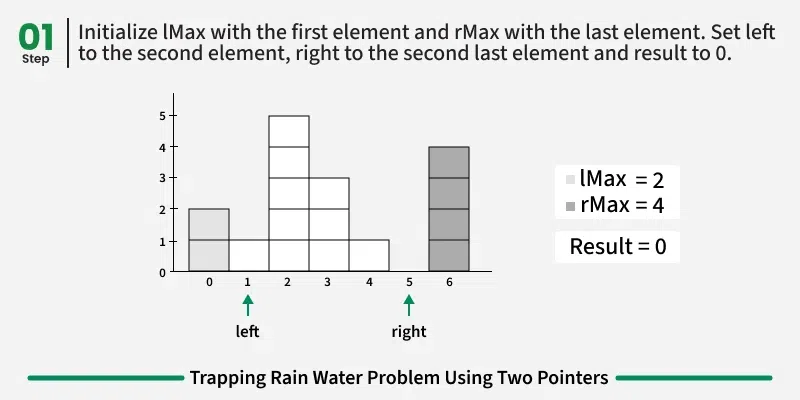
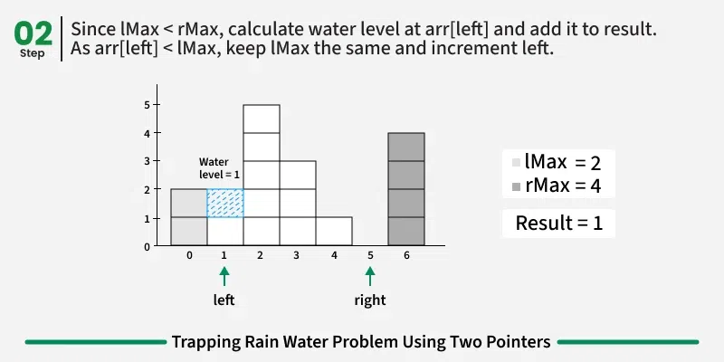
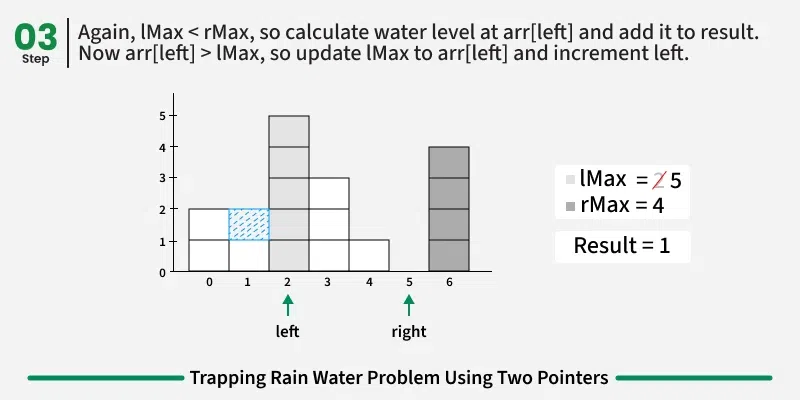
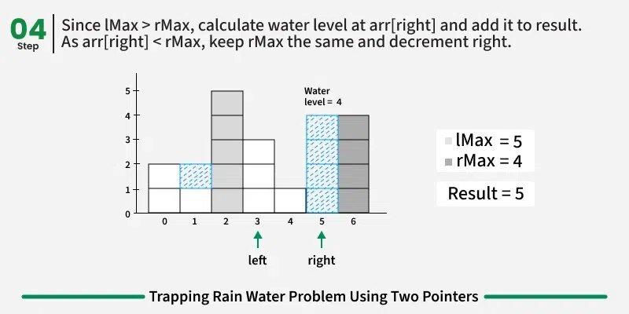
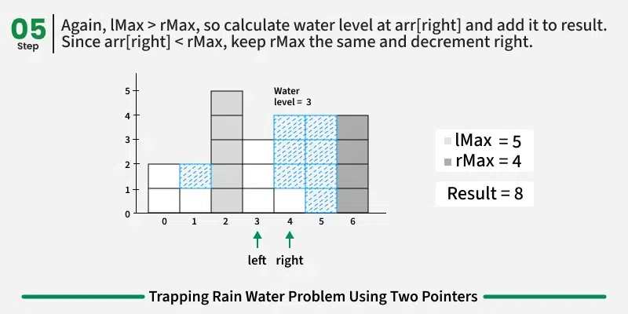
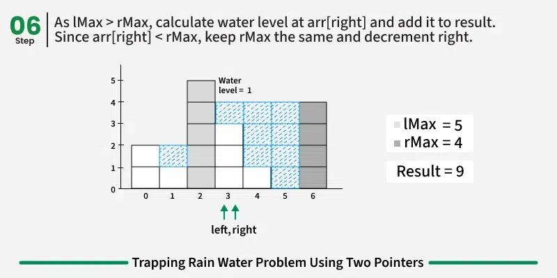
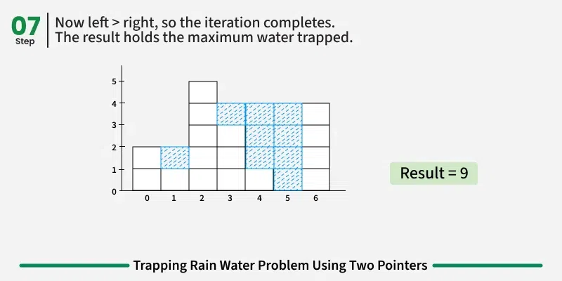
---
function maxWater(arr) {
    let left = 1;
    let right = arr.length - 2;

    // lMax : Maximum in subarray arr[0..left-1]
    // rMax : Maximum in subarray arr[right+1..n-1]
    let lMax = arr[left - 1];
    let rMax = arr[right + 1];

    let res = 0;
    while (left <= right) {
      
        // If rMax is smaller, then we can decide the 
        // amount of water for arr[right]
        if (rMax <= lMax) {
          
            // Add the water for arr[right]
            res += Math.max(0, rMax - arr[right]);

            // Update right max
            rMax = Math.max(rMax, arr[right]);

            // Update right pointer as we have decided 
            // the amount of water for this
            right -= 1;
        } else { 
            // Add the water for arr[left]
            res += Math.max(0, lMax - arr[left]);

            // Update left max
            lMax = Math.max(lMax, arr[left]);

            // Update left pointer as we have decided water for this
            left += 1;
        }
    }
    return res;
}

// Driver code
let arr = [2, 1, 5, 3, 1, 0, 4];
console.log(maxWater(arr));

## Problem 7: Reverse String

**Difficulty:** Easy  
**LeetCode #:** 344

### Description
Write a function that reverses a string. The input string is given as an array of characters `s`.

You must do this by modifying the input array **in-place** with `O(1)` extra memory.

### Example 1:
```
Input: s = ["h","e","l","l","o"]
Output: ["o","l","l","e","h"]
```

### Example 2:
```
Input: s = ["H","a","n","n","a","h"]
Output: ["h","a","n","n","a","H"]
```

### Constraints:
- `1 <= s.length <= 10^5`
- `s[i]` is a printable ascii character

### Test Cases:
```python
# Test Case 1
s = ["h","e","l","l","o"]
# Expected: ["o","l","l","e","h"]

# Test Case 2
s = ["H","a","n","n","a","h"]
# Expected: ["h","a","n","n","a","H"]

# Test Case 3
s = ["a"]
# Expected: ["a"]

# Test Case 4
s = ["A","B","C","D"]
# Expected: ["D","C","B","A"]
```

---

## Problem 8: Move Zeroes

**Difficulty:** Easy  
**LeetCode #:** 283

### Description
Given an integer array `nums`, move all `0`'s to the end of it while maintaining the relative order of the non-zero elements.

**Note** that you must do this in-place without making a copy of the array.

### Example 1:
```
Input: nums = [0,1,0,3,12]
Output: [1,3,12,0,0]
```

### Example 2:
```
Input: nums = [0]
Output: [0]
```

### Constraints:
- `1 <= nums.length <= 10^4`
- `-2^31 <= nums[i] <= 2^31 - 1`

### Test Cases:
```python
# Test Case 1
nums = [0,1,0,3,12]
# Expected: [1,3,12,0,0]

# Test Case 2
nums = [0]
# Expected: [0]

# Test Case 3
nums = [0,0,1]
# Expected: [1,0,0]

# Test Case 4
nums = [1,2,3,4,5]
# Expected: [1,2,3,4,5]

# Test Case 5
nums = [0,0,0,1,2,3]
# Expected: [1,2,3,0,0,0]
```

---

## Problem 9: Squares of a Sorted Array

**Difficulty:** Easy  
**LeetCode #:** 977

### Description
Given an integer array `nums` sorted in **non-decreasing** order, return *an array of **the squares of each number** sorted in non-decreasing order*.

### Example 1:
```
Input: nums = [-4,-1,0,3,10]
Output: [0,1,9,16,100]
Explanation: After squaring, the array becomes [16,1,0,9,100].
After sorting, it becomes [0,1,9,16,100].
```

### Example 2:
```
Input: nums = [-7,-3,2,3,11]
Output: [4,9,9,49,121]
```

### Constraints:
- `1 <= nums.length <= 10^4`
- `-10^4 <= nums[i] <= 10^4`
- `nums` is sorted in **non-decreasing** order

### Test Cases:
```python
# Test Case 1
nums = [-4,-1,0,3,10]
# Expected: [0,1,9,16,100]

# Test Case 2
nums = [-7,-3,2,3,11]
# Expected: [4,9,9,49,121]

# Test Case 3
nums = [-5,-3,-2,-1]
# Expected: [1,4,9,25]

# Test Case 4
nums = [1,2,3,4,5]
# Expected: [1,4,9,16,25]

# Test Case 5
nums = [-1,0,1]
# Expected: [0,1,1]
```

---

## Problem 10: 4Sum

**Difficulty:** Medium  
**LeetCode #:** 18

### Description
Given an array `nums` of `n` integers, return *an array of all the **unique** quadruplets `[nums[a], nums[b], nums[c], nums[d]]` such that*:

- `0 <= a, b, c, d < n`
- `a`, `b`, `c`, and `d` are **distinct**
- `nums[a] + nums[b] + nums[c] + nums[d] == target`

You may return the answer in **any order**.

### Example 1:
```
Input: nums = [1,0,-1,0,-2,2], target = 0
Output: [[-2,-1,1,2],[-2,0,0,2],[-1,0,0,1]]
```

### Example 2:
```
Input: nums = [2,2,2,2,2], target = 8
Output: [[2,2,2,2]]
```

### Constraints:
- `1 <= nums.length <= 200`
- `-10^9 <= nums[i] <= 10^9`
- `-10^9 <= target <= 10^9`

### Test Cases:
```python
# Test Case 1
nums = [1,0,-1,0,-2,2]
target = 0
# Expected: [[-2,-1,1,2],[-2,0,0,2],[-1,0,0,1]]

# Test Case 2
nums = [2,2,2,2,2]
target = 8
# Expected: [[2,2,2,2]]

# Test Case 3
nums = [-1,0,1,2,-1,-4]
target = -1
# Expected: [[-4,0,1,2],[-1,-1,0,1]]

# Test Case 4
nums = [0,0,0,0]
target = 0
# Expected: [[0,0,0,0]]
```

---

## Problem 11: Partition Labels

**Difficulty:** Medium  
**LeetCode #:** 763

### Description
You are given a string `s`. We want to partition the string into as many parts as possible so that each letter appears in at most one part.

Note that the partition is done so that after concatenating all the parts in order, the resultant string should be `s`.

Return *a list of integers representing the size of these parts*.

### Example 1:
```
Input: s = "ababcbacadefegdehijhklij"
Output: [9,7,8]
Explanation:
The partition is "ababcbaca", "defegde", "hijhklij".
This is a partition so that each letter appears in at most one part.
A partition like "ababcbacadefegde", "hijhklij" is incorrect, because it splits s into less parts.
```

### Example 2:
```
Input: s = "eccbbbbdec"
Output: [10]
```

### Constraints:
- `1 <= s.length <= 500`
- `s` consists of lowercase English letters

### Test Cases:
```python
# Test Case 1
s = "ababcbacadefegdehijhklij"
# Expected: [9,7,8]

# Test Case 2
s = "eccbbbbdec"
# Expected: [10]

# Test Case 3
s = "caedbdedda"
# Expected: [1,9]

# Test Case 4
s = "ab"
# Expected: [1,1]

# Test Case 5
s = "abc"
# Expected: [1,1,1]
```

---

## Problem 12: Sort Colors

**Difficulty:** Medium  
**LeetCode #:** 75

### Description
Given an array `nums` with `n` objects colored red, white, or blue, sort them **in-place** so that objects of the same color are adjacent, with the colors in the order red, white, and blue.

We will use the integers `0`, `1`, and `2` to represent the color red, white, and blue, respectively.

You must solve this problem without using the library's sort function.

### Example 1:
```
Input: nums = [2,0,2,1,1,0]
Output: [0,0,1,1,2,2]
```

### Example 2:
```
Input: nums = [2,0,1]
Output: [0,1,2]
```

### Constraints:
- `n == nums.length`
- `1 <= n <= 300`
- `nums[i]` is either `0`, `1`, or `2`

### Test Cases:
```python
# Test Case 1
nums = [2,0,2,1,1,0]
# Expected: [0,0,1,1,2,2]

# Test Case 2
nums = [2,0,1]
# Expected: [0,1,2]

# Test Case 3
nums = [0]
# Expected: [0]

# Test Case 4
nums = [1]
# Expected: [1]

# Test Case 5
nums = [2,2,2,1,1,1,0,0,0]
# Expected: [0,0,0,1,1,1,2,2,2]
```

---

## Problem 13: Longest Substring Without Repeating Characters

**Difficulty:** Medium  
**LeetCode #:** 3

### Description
Given a string `s`, find the length of the **longest substring** without repeating characters.

### Example 1:
```
Input: s = "abcabcbb"
Output: 3
Explanation: The answer is "abc", with the length of 3.
```

### Example 2:
```
Input: s = "bbbbb"
Output: 1
Explanation: The answer is "b", with the length of 1.
```

### Example 3:
```
Input: s = "pwwkew"
Output: 3
Explanation: The answer is "wke", with the length of 3.
Notice that the answer must be a substring, "pwke" is a subsequence and not a substring.
```

### Constraints:
- `0 <= s.length <= 5 * 10^4`
- `s` consists of English letters, digits, symbols and spaces

### Test Cases:
```python
# Test Case 1
s = "abcabcbb"
# Expected: 3

# Test Case 2
s = "bbbbb"
# Expected: 1

# Test Case 3
s = "pwwkew"
# Expected: 3

# Test Case 4
s = ""
# Expected: 0

# Test Case 5
s = "dvdf"
# Expected: 3

# Test Case 6
s = "abcdef"
# Expected: 6
```

---

## Problem 14: Minimum Window Substring

**Difficulty:** Hard  
**LeetCode #:** 76

### Description
Given two strings `s` and `t` of lengths `m` and `n` respectively, return *the **minimum window substring** of `s` such that every character in `t` (including duplicates) is included in the window. If there is no such substring, return the empty string `""`*.

The testcases will be generated such that the answer is **unique**.

A **substring** is a contiguous sequence of characters within the string.

### Example 1:
```
Input: s = "ADOBECODEBANC", t = "ABC"
Output: "BANC"
Explanation: The minimum window substring "BANC" includes 'A', 'B', and 'C' from string t.
```

### Example 2:
```
Input: s = "a", t = "a"
Output: "a"
```

### Example 3:
```
Input: s = "a", t = "aa"
Output: ""
Explanation: Both 'a's from t must be included in the window.
Since the largest window of s only has one 'a', return empty string.
```

### Constraints:
- `m == s.length`
- `n == t.length`
- `1 <= m, n <= 10^5`
- `s` and `t` consist of uppercase and lowercase English letters

### Test Cases:
```python
# Test Case 1
s = "ADOBECODEBANC"
t = "ABC"
# Expected: "BANC"

# Test Case 2
s = "a"
t = "a"
# Expected: "a"

# Test Case 3
s = "a"
t = "aa"
# Expected: ""

# Test Case 4
s = "ab"
t = "b"
# Expected: "b"

# Test Case 5
s = "bba"
t = "ab"
# Expected: "ba"
```

---

## Problem 15: Backspace String Compare

**Difficulty:** Easy  
**LeetCode #:** 844

### Description
Given two strings `s` and `t`, return `true` *if they are equal when both are typed into empty text editors. `'#'` means a backspace character*.

Note that after backspacing an empty text, the text will continue empty.

### Example 1:
```
Input: s = "ab#c", t = "ad#c"
Output: true
Explanation: Both s and t become "ac".
```

### Example 2:
```
Input: s = "ab##", t = "c#d#"
Output: true
Explanation: Both s and t become "".
```

### Example 3:
```
Input: s = "a#c", t = "b"
Output: false
Explanation: s becomes "c" while t becomes "b".
```

### Constraints:
- `1 <= s.length, t.length <= 200`
- `s` and `t` only contain lowercase letters and `'#'` characters

### Test Cases:
```python
# Test Case 1
s = "ab#c"
t = "ad#c"
# Expected: True

# Test Case 2
s = "ab##"
t = "c#d#"
# Expected: True

# Test Case 3
s = "a#c"
t = "b"
# Expected: False

# Test Case 4
s = "y#fo##f"
t = "y#f#o##f"
# Expected: True

# Test Case 5
s = "a##c"
t = "#a#c"
# Expected: True
```

---

## Problem 16: Is Subsequence

**Difficulty:** Easy  
**LeetCode #:** 392

### Description
Given two strings `s` and `t`, return `true` *if `s` is a **subsequence** of `t`, or `false` otherwise*.

A **subsequence** of a string is a new string that is formed from the original string by deleting some (can be none) of the characters without disturbing the relative positions of the remaining characters. (i.e., `"ace"` is a subsequence of `"abcde"` while `"aec"` is not).

### Example 1:
```
Input: s = "abc", t = "ahbgdc"
Output: true
```

### Example 2:
```
Input: s = "axc", t = "ahbgdc"
Output: false
```

### Constraints:
- `0 <= s.length <= 100`
- `0 <= t.length <= 10^4`
- `s` and `t` consist only of lowercase English letters

### Test Cases:
```python
# Test Case 1
s = "abc"
t = "ahbgdc"
# Expected: True

# Test Case 2
s = "axc"
t = "ahbgdc"
# Expected: False

# Test Case 3
s = ""
t = "ahbgdc"
# Expected: True

# Test Case 4
s = "b"
t = "abc"
# Expected: True

# Test Case 5
s = "ace"
t = "abcde"
# Expected: True
```

---

## Problem 17: Boats to Save People

**Difficulty:** Medium  
**LeetCode #:** 881

### Description
You are given an array `people` where `people[i]` is the weight of the `i`th person, and an infinite number of boats where each boat can carry a maximum weight of `limit`. Each boat carries at most two people at the same time, provided the sum of the weight of those people is at most `limit`.

Return *the minimum number of boats to carry every given person*.

### Example 1:
```
Input: people = [1,2], limit = 3
Output: 1
Explanation: 1 boat (1, 2)
```

### Example 2:
```
Input: people = [3,2,2,1], limit = 3
Output: 3
Explanation: 3 boats (1, 2), (2) and (3)
```

### Example 3:
```
Input: people = [3,5,3,4], limit = 5
Output: 4
Explanation: 4 boats (3), (3), (4), (5)
```

### Constraints:
- `1 <= people.length <= 5 * 10^4`
- `1 <= people[i] <= limit <= 3 * 10^4`

### Test Cases:
```python
# Test Case 1
people = [1,2]
limit = 3
# Expected: 1

# Test Case 2
people = [3,2,2,1]
limit = 3
# Expected: 3

# Test Case 3
people = [3,5,3,4]
limit = 5
# Expected: 4

# Test Case 4
people = [1,2,3,4,5]
limit = 5
# Expected: 3

# Test Case 5
people = [2,2,2,2]
limit = 4
# Expected: 2
```

---

## Problem 18: Reverse Words in a String

**Difficulty:** Medium  
**LeetCode #:** 151

### Description
Given an input string `s`, reverse the order of the **words**.

A **word** is defined as a sequence of non-space characters. The words in `s` will be separated by at least one space.

Return *a string of the words in reverse order concatenated by a single space*.

**Note** that `s` may contain leading or trailing spaces or multiple spaces between two words. The returned string should only have a single space separating the words. Do not include any extra spaces.

### Example 1:
```
Input: s = "the sky is blue"
Output: "blue is sky the"
```

### Example 2:
```
Input: s = "  hello world  "
Output: "world hello"
Explanation: Your reversed string should not contain leading or trailing spaces.
```

### Example 3:
```
Input: s = "a good   example"
Output: "example good a"
Explanation: You need to reduce multiple spaces between two words to a single space in the reversed string.
```

### Constraints:
- `1 <= s.length <= 10^4`
- `s` contains English letters (upper-case and lower-case), digits, and spaces `' '`
- There is **at least one** word in `s`

### Test Cases:
```python
# Test Case 1
s = "the sky is blue"
# Expected: "blue is sky the"

# Test Case 2
s = "  hello world  "
# Expected: "world hello"

# Test Case 3
s = "a good   example"
# Expected: "example good a"

# Test Case 4
s = "  Bob    Loves  Alice   "
# Expected: "Alice Loves Bob"

# Test Case 5
s = "Alice does not even like bob"
# Expected: "bob like even not does Alice"
```

---

## Problem 19: Linked List Cycle

**Difficulty:** Easy  
**LeetCode #:** 141

### Description
Given `head`, the head of a linked list, determine if the linked list has a cycle in it.

There is a cycle in a linked list if there is some node in the list that can be reached again by continuously following the `next` pointer. Internally, `pos` is used to denote the index of the node that tail's `next` pointer is connected to. **Note that `pos` is not passed as a parameter**.

Return `true` *if there is a cycle in the linked list*. Otherwise, return `false`.

### Example 1:
```
Input: head = [3,2,0,-4], pos = 1
Output: true
Explanation: There is a cycle in the linked list, where the tail connects to the 1st node (0-indexed).
```

### Example 2:
```
Input: head = [1,2], pos = 0
Output: true
Explanation: There is a cycle in the linked list, where the tail connects to the 0th node.
```

### Example 3:
```
Input: head = [1], pos = -1
Output: false
Explanation: There is no cycle in the linked list.
```

### Constraints:
- The number of the nodes in the list is in the range `[0, 10^4]`
- `-10^5 <= Node.val <= 10^5`
- `pos` is `-1` or a **valid index** in the linked-list

### Test Cases:
```python
# Test Case 1
# head = [3,2,0,-4], pos = 1 (cycle at index 1)
# Expected: True

# Test Case 2
# head = [1,2], pos = 0 (cycle at index 0)
# Expected: True

# Test Case 3
# head = [1], pos = -1 (no cycle)
# Expected: False

# Test Case 4
# head = [], pos = -1 (empty list)
# Expected: False

# Test Case 5
# head = [1,2,3,4,5], pos = 2 (cycle at index 2)
# Expected: True
```

---

## Problem 20: Middle of the Linked List

**Difficulty:** Easy  
**LeetCode #:** 876

### Description
Given the `head` of a singly linked list, return *the middle node of the linked list*.

If there are two middle nodes, return **the second middle** node.

### Example 1:
```
Input: head = [1,2,3,4,5]
Output: [3,4,5]
Explanation: The middle node of the list is node 3.
```

### Example 2:
```
Input: head = [1,2,3,4,5,6]
Output: [4,5,6]
Explanation: Since the list has two middle nodes with values 3 and 4, we return the second one.
```

### Constraints:
- The number of nodes in the list is in the range `[1, 100]`
- `1 <= Node.val <= 100`

### Test Cases:
```python
# Test Case 1
# head = [1,2,3,4,5]
# Expected: [3,4,5] (node with value 3)

# Test Case 2
# head = [1,2,3,4,5,6]
# Expected: [4,5,6] (node with value 4)

# Test Case 3
# head = [1]
# Expected: [1]

# Test Case 4
# head = [1,2]
# Expected: [2]

# Test Case 5
# head = [1,2,3]
# Expected: [2,3] (node with value 2)
```

---

## Summary

These 20 problems cover various applications of the two-pointer technique:

- **Opposite Ends**: Problems 1, 3, 6, 9, 11, 12, 17
- **Fast & Slow**: Problems 5, 8, 19, 20
- **Sliding Window**: Problems 13, 14
- **String Manipulation**: Problems 2, 7, 15, 16, 18
- **Multiple Pointers**: Problems 4, 10

Practice these problems to master the two-pointer technique! Remember:
- Start with easy problems
- Understand the pattern before coding
- Draw diagrams to visualize pointer movements
- Consider edge cases (empty arrays, single elements, etc.)

Good luck! 🚀


